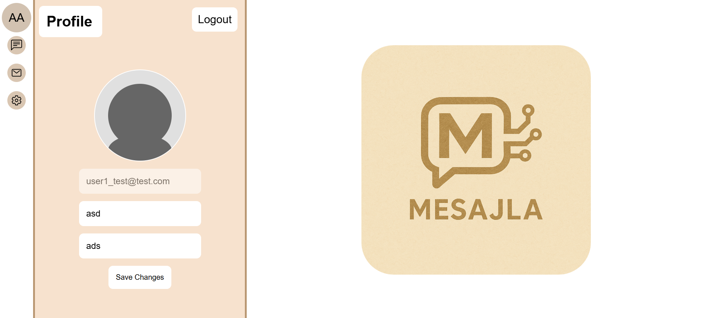

# 💬 Mesajla — Real-Time AI-Powered Chat Application

Mesajla is a full-stack, real-time chat application with modern features such as AI-generated message suggestions, custom messaging styles, and group or one-on-one communication — all wrapped in a responsive and user-friendly interface. Whether you're chatting casually or professionally, Mesajla adapts with its intelligent reply generation and customizable options.

---

## Tech Stack

Frontend
- React.js

Backend
- Node.js (API & Socket.IO)
- Python (Flask for AI response engine)

Database & Storage
- MongoDB (chat storage, users, settings)
- Firebase (file and media storage)

---

## Core Pages

- Sign In & Sign Up — Secure entry with salt-paper hashing
- Profile Registration — Configure profile, avatar, display name
- Chat Interface — Real-time messaging with full media support
- Mascot Guided Onboarding — Animated assistant helps you through account setup

<table>
  <tr>
    <td></td>
    <td></td>
  </tr>
 <tr>
    <td></td>
    <td></td>
  </tr>
</table>

---

## Authentication: Salt & Paper

Passwords are protected using a secure hashing strategy:

- Each user gets a unique salt
- A global paper value is kept server-side
- Hash = hash(salt + user_password + paper)

Thus, passwords are stored as encrypted hashes insead of plain text

---

## Key Features

💬 Messaging
- Real-time 1-on-1 and group messaging

- Message timestamps & unread indicators

- Message color styling with custom CSS values

- Send messages in bold or italic using:

